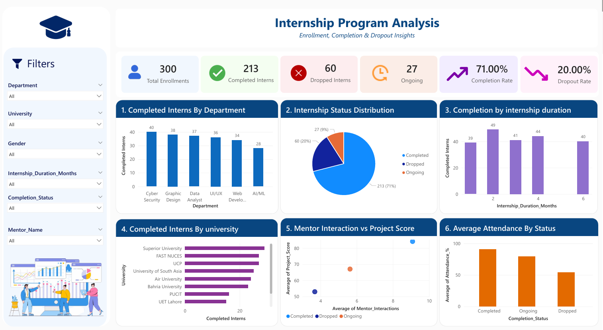

# Internship Program Analysis Dashboard

**Created & Analyzed by Hafsa Asif**  
*Data Analyst | Power BI Developer*

---

# Project Overview

The **Internship Program Analysis Dashboard** is an interactive Power BI project developed to analyze internship performance and identify the key factors that contribute to successful internship completion.

The dashboard transforms raw internship data into meaningful insights by analyzing enrollment trends, completion rates, dropout rates, mentor interactions, attendance, internship duration, departmental performance, and university contributions. Through interactive visualizations and KPI cards, stakeholders can monitor internship outcomes and make informed decisions to improve future internship programs.

---

# Project Objective

The primary objective of this project is to analyze internship performance and identify the factors influencing intern success.

This dashboard was developed to:

- Analyze internship enrollment, completion, and dropout statistics.
- Identify trends across departments, internship duration, universities, and mentor interactions.
- Evaluate intern performance using interactive Power BI visualizations.
- Monitor attendance and project performance.
- Support data-driven decision-making for improving internship programs.

---

# Dataset Overview

The project uses an internship dataset containing information about interns, their academic background, internship details, mentor engagement, attendance, and project performance.

| Column | Data Type | Description |
|--------|-----------|-------------|
| Intern_ID | Integer | Unique identifier for each intern |
| Intern_Name | Text | Name of the intern |
| Gender | Text | Gender of the intern |
| Age | Integer | Age of the intern |
| University | Text | University of the intern |
| CGPA | Decimal | Academic CGPA |
| Department | Text | Internship department |
| Enrollment_Date | Date | Internship enrollment date |
| Internship_Duration_Months | Integer | Internship duration in months |
| Mentor_Name | Text | Assigned mentor |
| Mentor_Interactions | Integer | Number of mentor meetings/interactions |
| Attendance_% | Percentage | Internship attendance |
| Project_Score | Percentage | Final project evaluation score |
| Completion_Status | Text | Completed, Dropped, or Ongoing |
| Dropout_Reason | Text | Reason for dropping out (if applicable) |
---

# Tools & Technologies

- Microsoft Power BI
- Microsoft Excel
- Power Query
- DAX (Data Analysis Expressions)
- Data Modeling
- Data Visualization
- Business Intelligence

---

# Dashboard Overview

The dashboard provides a comprehensive overview of internship performance through interactive KPI cards, charts, and slicers.

## Key Performance Indicators (KPIs)

| KPI | Value |
|------|--------|
| Total Enrollments | **15,000** |
| Completed Interns | **10,000** |
| Dropped Interns | **3,082** |
| Ongoing Interns | **1,525** |
| Completion Rate | **69.29%** |
| Dropout Rate | **20.55%** |

---

# Dashboard Visualizations

## 1. Completed Interns by Department

Displays the number of interns who successfully completed internships across different departments, enabling comparison of departmental performance.

---

## 2. Internship Status Distribution

A pie chart showing the distribution of internship status:

- Completed
- Dropped
- Ongoing

This provides a quick overview of internship outcomes.

---

## 3. Completion by Internship Duration

Shows how internship duration impacts successful completion by comparing interns across different internship lengths.

---

## 4. Completed Interns by University

Compares internship completion across universities to identify institutions contributing the highest number of successful interns.

---

## 5. Mentor Interaction vs Project Score

A scatter plot illustrating the relationship between mentor interactions and project performance.

This visualization helps determine whether increased mentor engagement contributes to better project outcomes.

---

## 6. Average Attendance by Completion Status

Compares average attendance among:

- Completed Interns
- Ongoing Interns
- Dropped Interns

This highlights the relationship between attendance and internship success.

---

# Interactive Features

The dashboard includes interactive slicers for:

- Department
- University
- Gender
- Internship Duration
- Completion Status
- Mentor Name

Users can dynamically filter the dashboard to analyze internship performance from different perspectives.

---

# Key Insights

Based on the dashboard analysis:

- **15,000** internship enrollments were analyzed.
- **10,000 interns (69.29%)** successfully completed the internship program.
- **3,082 interns (20.55%)** dropped out before completion.
- **1,525 interns** are currently participating in ongoing internships.
- Department-wise analysis highlights variations in internship completion across different domains.
- Universities such as **ITU Lahore**, **COMSATS**, and **UCP** contributed significantly to internship completions.
- Higher mentor interaction generally resulted in better project performance.
- Completed interns maintained higher attendance than dropped interns.
- Internship duration showed a noticeable impact on completion trends.

---

# Business Recommendations

Based on the analysis, the following recommendations can improve internship success:

- Increase mentor engagement through regular mentoring sessions.
- Monitor attendance to identify at-risk interns early.
- Strengthen support for departments with lower completion rates.
- Review internship duration policies to maximize completion rates.
- Analyze dropout reasons to improve intern retention.
- Utilize dashboard insights for future internship planning and resource allocation.

---

# Dashboard Preview

> Place your dashboard screenshot in the repository as **Dashboard.png**





---

# Repository Structure

```text
Internship-Program-Analysis-Dashboard
│
├── Internship Program Analysis.pbix
├── Internship_Completion_Dataset.xlsx
├── dashboard.png
├── Internship Program Analysis.pdf
├── README.md
├── LICENSE
└── .gitignore
```

---

# Project Learnings

This project strengthened my understanding of:

- Power BI Dashboard Development
- Data Cleaning using Power Query
- Data Modeling
- DAX Measures & KPI Calculations
- Interactive Dashboard Design
- Business Intelligence Reporting
- Data Visualization
- Business Insight Generation
- Data Storytelling

This project enhanced my ability to transform raw data into actionable insights that support business decision-making.

---

# Future Improvements

Potential enhancements for future versions include:

- Multi-page dashboard with advanced analytics
- Time-series enrollment trend analysis
- Predictive modeling for internship completion
- Drill-through pages for detailed intern information
- Real-time dashboard using Power BI Service
- SQL database integration
- AI-powered insights and forecasting

---

# 👩‍💻 About Me

## Hafsa Asif

**BS Computer Science Student**  
**Data Analyst | Power BI Developer**

### Skills

- Power BI
- SQL
- Python
- Microsoft Excel
- Power Query
- DAX
- Data Visualization
- Data Analysis
- Business Intelligence

---

⭐ **If you found this project helpful, please consider giving it a Star!**
